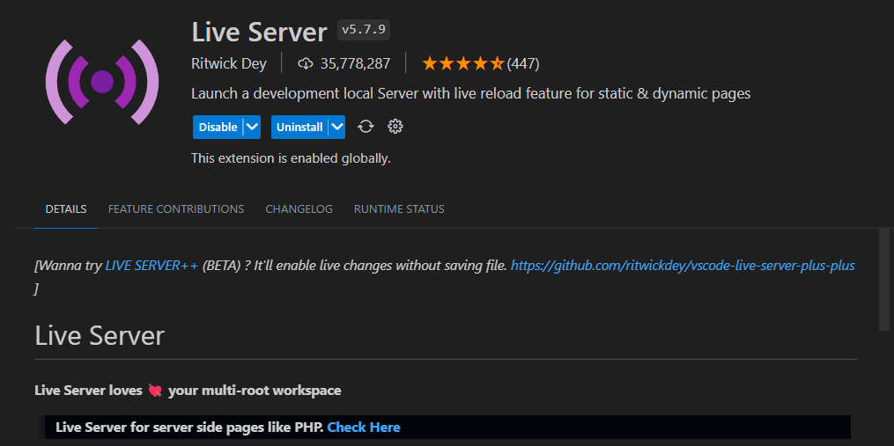
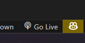
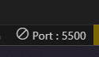

# CCAPDEV Machine Project
## Group Members
- Diaz, Sebastian
- Go, Daphne Janelyn
- Lasala, Kyle Carlo
- Manlises, Maria Monica
## Food Store Review Web Application
- A food store review web application for the food stores near in DLSU. Specifically designed for Lasallians in DLSU-Manila. This project serves as a course requirement in Web Application Development (CCAPDEV).
## Running the Web Application
- Open Visual Studio Code
- Open the directory where the "index.html" is located
- First install a live a live server extension

- Click the "go live" icon that can be found in the bottom right corner
 

- Once clicked the icon should look like this: 

## Demo
- We provided a demo of our MCO Phase 1 for your reference
- Link: <a href="https://zoom.us/rec/share/aCsSl4wdQ2Q45PTk3lSUpAx54eJQglp8HpfCf2Ci_2PGB7Fy3XSmoEIo11ZoGhfB.9f-Dnmcx_wWewAKV?startTime=1687520229000">https://zoom.us/rec/share/aCsSl4wdQ2Q45PTk3lSUpAx54eJQglp8HpfCf2Ci_2PGB7Fy3XSmoEIo11ZoGhfB.9f-Dnmcx_wWewAKV?startTime=1687520229000</a>
- Password: yrb8ct7@
